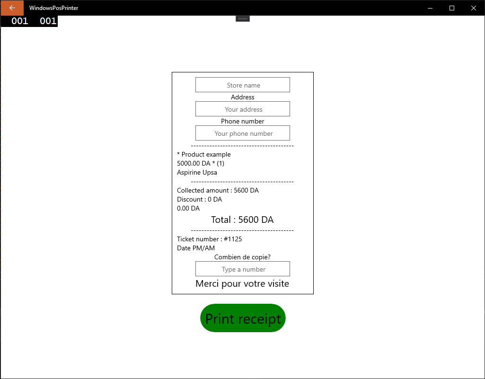

# react-native-windows-posprinter

This repo shows how to implement a native module in windows in order to use it from react native so you can print and open your cash drawer.

# Screenshots

# Contributing

Pull requests are welcome. For major changes, please open an issue first to discuss what you would like to change.

Please make sure to update tests as appropriate.
